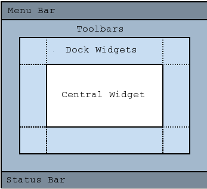

# Qt Class Reference
## Qt类索引
[A](#index-A)
[B](#index-B)
[C](#index-C)
[D](#index-D)
[E](#index-E)
[F](#index-F)
[G](#index-G)
[H](#index-H)
[I](#index-I)
[J](#index-J)
[K](#index-K)
[L](#index-L)
[M](#index-M)
[N](#index-N)
[O](#index-O)
[P](#index-P)
[Q](#index-Q)
[R](#index-R)
[S](#index-S)
[T](#index-T)
[U](#index-U)
[V](#index-V)
[W](#index-W)
[X](#index-X)
[Y](#index-Y)
[Z](#index-Z)

<div id="index-A"/>
<div id="index-B"/>

## QBitmap
QBitmap类提供了黑白（一位深度）像素图。

QBitmap类主要用于单色绘图设备中创建自定以的QCursor和QBrush对象，构建QRegion对象以及为像素图(pixmaps)和部件(widgets)设置遮罩(masking).

QBitmap类是QPixmap类的子类，它定义了深度为1的像素图，除非是空对象，它的深度为0。如果一个深度大于1的像素图赋值给位图(bitmap)，该位图会自动混色(dithered).

（混色：将其他颜色混合在一起得到另一种颜色。）

当在QBitmap（或者深度为1的QPixmap）上绘图的时候应使用QColor对象的Qt::Qt::color0.

绘图时使用Qt::color0会将位图位设为0，使用Qt::color1将位图位设为1.对于一个位图来说，0-bits指定了背景色(或者像素的透明度)，1-bits指定了前景色（或者像素的不透明度）。使用clear()函数可以将所有比特位设置为Qt::color0。注意使用Qt::black和Qt::white颜色是没有意义的，因为QColor::pixel()的值不一定0就是黑色，1就是白色。

QBitmap类提供了transformed()方法可以返回转换后的拷贝的位图。使用QTransfrom类作为参数，可以平移，缩放，裁剪和旋转位图。另外，QBitmap提供了静态成员函数fromData()用户返回从给定的uchar数据构造的位图，还有静态成员函数fromImage()返回从QImage对象转换的拷贝。

和QPixmap一样，QBitmap也使用[隐式数据分享](ImplicitSharing.md)进行了优化。

## QBrush
QBrush类定义了QPainter进行形状填充的模式。

一个画刷(brush)有一个风格，颜色，渐变(gradient)和纹理。

画刷的风格通过Qt::BrushStyle枚举类型定义填充的模式。默认的画刷风格是Qt::NoBrush.该风格是告诉QPainter不进行形状填充。Qt::SolidPattern风格是标准画刷风格。画刷的风格可以在构造画刷对象的时候设置，也可以在创建完成后使用setStyle()函数设置。

画刷的颜色定义了填充的颜色。颜色可以是Qt中预定义的颜色，Qt::GlobalColor,或者其他自定义的颜色。当前的颜色值可以通过color()获取，以及使用setColor()函数设置。

当画刷的风格是Qt::LinearGradientPattern,Qt::RadialGradientPattern或者Qt::ConicalGradientPattern模式时，画刷的填充为渐变填充。渐变填充风格的画刷，只需要在构造画刷对象的时候传入QGradient对象即可。Qt中提供了几种不同风格的渐变：QLinearGradient,QConicalGradient,QRadialGradient,它们都继承了QGradient类。

```
    QRdialGradient gradient(50,50,50,50,50);
    gradient.setColorAt(0,QColor::fromRgbF(0,1,0,1));
    gradient.setColorAt(1,QColor::fromRgbF(0,0,0,0));

    QBrush brush(gradient);
```

画刷的纹理定义了其在Qt::TexturePattern模式下，使用的像素图纹理。可以在创建画刷对象时设置作为纹理的像素图，也可以使用setTexture()设置纹理。

当画刷是完全不透明的，isOpaque()函数返回为true，否则就返回false.画刷在一下情况下是不透明的：  
* 画刷颜色的alpha值是255.
* 画刷的纹理没有alpha通道并且不是QBitmap
* 渐变的颜色有alpha通道且为255

使用QPainter的Qt::PenStyle和Qt::GlobalColor设置线和线框的风格和颜色:

```
    QPainter painter(this);
    painter.setBrush(Qt::cyan);
    painter.setPen(Qt::darkCyan);
    painter.drawRect(0,0,100,100);

    painter.setBrush(Qt::NoBrush);
    painter.setPen(Qt::darkGreen);
    painter.drawRect(40,40,100,100);
```

注意，默认情况下，QPainter在绘制形状时渲染边框（使用当前设置的画笔）。使用painter.setPen(Qt::NoPen)可以禁止此行为。

<div id="index-C"/>
<div id="index-D"/>
<div id="index-E"/>
<div id="index-F"/>
<div id="index-G"/>

## QGraphicsItem
QGraphicsItem类是QGraphicsScene中所有图形项的基类。

该类提供了构建自定义可视项的轻量的基础内容。包括定义可视项的几何形状，碰撞检测，绘制实现以及事件处理。QGraphicsItem类是[图形视图框架](GraphicsViewFramework.md)的一部分。

为了方便，Qt中预定义了几种常用的基于QGraphicsItem的几何形状，它们是：  
* QGraphicsEllipseItem 用于绘制椭圆形
* QGraphicsLineItem 用于绘制直线
* QGraphicsPathItem 用于绘制任意路径图形项
* QGraphicsPixmapItem 用于绘制像素图
* QGraphicsPolygonItem 用于绘制多边形
* QGraphicsRectItem 用于绘制矩形
* QGraphicsSimpleItem 绘制简单文本标签项
* QGraphicsTextItem 用于绘制更高级的文本浏览器项

除了可视项的位置信息，通过pos()函数，返回其所在父对象坐标系中的位置外，可视项的所有几何形状信息都是基于其本地坐标系。

你可是通过setVisible()函数设置可视项是否可见（例如，绘制以及接受事件）。隐藏可视项，会将其子类也全部隐藏。同样地，使用setEnabled()函数，可以启用或者禁用可视项。要转换一个可视项选择与否，首先使用ItemIsSelectable标志，然后调用setSelected()来选择。一般情况下，选择的转换是通过场景的用户交互来决定的。

要实现自己的可视项，首先需要继承QGraphicsItem类，然后实现该类的公共纯虚函数：boundingRect()，该函数返回该可视项绘制的区域；paint()，是执行可视项绘制的函数。例如:

```
    class SimpleItem: public QGraphicsItem
    {
    public:
        QRectF boundingRect() const
        {
            qreal penWidth = 1;
            return QRectF(-10 - penWidth / 2, -10 - penWidth / 2, 20 + penWidth, 20 + penWidth);
        }

        void paint(QPainter* painter, cosnt QStyleOptionGraphicsItem* option, QWidget* widget)
        {
            painter->drawRoundedRect(-10,-10,20,20,5,5);
        }
    };
```

boundingRect()函数有许多不同的用途。QGraphicsScene对象根据QGraphicsItem的boundingRect()函数放置可视项，QGraphicsView对象则使用该函数来取出可视项不可见的部分以及决定可视项重叠的部分需要重新调整的区域。另外，QGraphicsItem的碰撞检测机制使用boundingRect()函数来提供高效的截断。collidesWithItem()函数中的纹理碰撞算法基于调用shape()获取的可视项的QPainterPath类型的边界。

QGraphicsSCene类希望所有可视项的boundingRect()和shape()函数都保持不变，除非特别提示需要改变。如果需要改变一个可视项的几何形状，你必选先调用prepareGeometryChange()来允许QGraphicsScene更新其记录。

碰撞检测可以通过两种方式实现：  
1. 重载shape()函数以返回自定义项的实际几何形状，然后使用collidesWithItem()函数的默认实现方式来执行形状间交叉的检测。如果自定义形状很复杂的话，会产生产生较大的开销。
2. 重载collidesWithItem()函数以提供自定义的碰撞检测算法。

contains()函数可以用于检查可视项中是否包含制定点。该函数同样可以被重载。contains()函数的默认实现基于对shape()函数的调用。

一个可视项可以包含其他的可视项，也可以被其他项包含。一个可视项可以拥有一个父对象和一系列子对象。可视项的位置是基于父对象的坐标系的，除非它没有父对象。父对象会将自身的位置和转换传递给所以子对象。

### Transformations
QGraphicsItem类除了其基本位置pos()外，都支持投影变换。

。。。。。。。

#### [pure virutal] QRectF QGraphicsItem::boundingRect() const


<font color="#ff8888">未完成</font>

## QGraphicsScene
QGraphicsScene类提供了用于管理大量2D图形项的表面(surface)。

该类是作为QGraphicsItem类的容器使用。该类是和QGraphicsView一起使用以显示可视项，例如直线，矩形，文本，或者自定义可视项。QGraphicsScene是图形视图框架的一部分。


<div id="index-H"/>
<div id="index-I"/>

## QIcon
QIcon类支持不同模式和状态的可缩放图标。

<font color="#ff888">未完成</font>

## QImage
QImage类提供了与硬件平台无关的图像支持，并可以直接操作图像的像素数据。QImage也可以作为绘图的目标设备。

Qt提供了四种处理图像数据类：QImage,QPixmap,QBitmap,QPicture.QImage类为I/O操作进行了优化，可以直接对像素进行访问和操作。QPixmap为显示图像到屏幕做了优化。QBitmap是从QPixmap类派生而来，其像素深度为1.最后，QPicture类表示一个记录和重绘制QPainter命令的绘图设备。

因为QImage是QPaintDevice的子类，所以QPainter类可以直接在QImage上绘图。当使用QPainter在QImage对象上绘图时，绘图操作可以在其他线程中执行，而不是当前的GUI线程中。

<font color="#ff8888">未完成</font>

<div id="index-J"/>
<div id="index-K"/>
<div id="index-L"/>
<div id="index-M"/>

## QMainWindow
QMainWindow类提供了一个应用主窗口。

### Qt Main Window Framework
一个主窗口提供了构建用户交互界面的框架。Qt中有QMainWindow和相关的类来共同管理主窗体。QMainWindow中有自己的布局器(Layouts)，可以直接添加QToolBar,QDockWidget,QMenuBar,QStatusBar。布局器中有一个中心区域(center area)可以添加任意类型的widget进去。下图是QMainWindow的示意图。  
  
注意：在创建主窗体时是不能没有中心窗体的。你必须为主窗体添加一个部件，即使是空白占位符(placeholders)。

### Creating Main Window Components
中心部件一般是典型的Qt部件，如QTextEdit或者QGraphicsView等。当谭还可以使用自定义的部件。设置中心部件时，使用setCentralWidget()函数。

主窗口拥有单文档和多文档类型接口。可以使用QMdiArea作为中心部件来创建爱你多文档类型应用。

接下来介绍其他可以添加到主窗体中的部件部分。每一个都给出了简单的示例。

#### Creating Menus
Qt使用QMenu类实现菜单，并使用QMainWidnow类将菜单保存在QMneuBar类对象中。QAction是添加到QMenu中的，用于显示菜单的子选项。

向主窗体的QMenuBar添加菜单时，可以使用menuBar()方法返回菜单栏对象，然后调用其addMenuBar()方法。如果想添加自定义的菜单栏到主窗体（不使用QMenuBar部件），可以使用setMenuWidget()方法添加自定义菜单栏部件。

下面是一个创建菜单的实例：  

```
    void MainWindow::createMenus()
    {
        filemenu = menuBar()->addMenu(tr("&File"));
        filemenu->addAction(newAct);
        filemenu->addAction(openAct);
        filemenu->addAction(saveAct);
    }
```

createPopupMenu()函数用于在主窗体接收到上下文菜单事件时创建弹出式菜单。默认的实现是从dock部件和工具栏中使用可复选的菜单动作生成菜单。你可以为自定义菜单重载createPopupMenu()函数。

#### Creating ToolBars
工具栏(Toolbar)是在QToolBar类中实现的。使用addToolBar()函数向主窗体添加工具栏。

你可以使用Qt::ToolBarArea来指定工具栏的初始位置。你可以通过插入工具栏分割线来拆分工具栏区域 - 将这个想成在文本编辑中的分割线。使用addToolBarBreak()或者insertToolBarBreak()函数即可实现。你可以使用QToolBar::setAllowedAreas()和QToolBar::setMovable()函数来限制布局位置。

工具栏的icon尺寸可以通过iconSize()函数查询。该尺寸与平台相关；你可以使用setIconSize()来设置固定的图标大小。你可以使用setToolButtonStyle()函数改变菜单栏中按钮的外观。

下面是创建工具栏的例子：

```
    void MainWindow::createToolBars()
    {
        fileToolBar = addToolBar(tr("File"));
        fileToolBar->addAction(newAct);
    }
```

#### Creating Dock Widgets
停靠部件(Dock Widgets)是通过QDockWidget类实现的。一个停靠部件是值可以停靠在主窗体中的窗体。你可以使用addDockWidget()函数向主窗体中添加停靠部件。

Qt::DockWidgetArea枚举类型中定义了四种停靠部件区域：left,right,top,bottom.You can specify which dock widget area that should occupy the corners where the areas overlap with setCorner().默认情况下，每一个停靠部件区域只能包含一行或者一列停靠部件。但是如果使用stDockNestingEnabled()函数开启了嵌套(nesting)功能，停靠部件也可以被添加到任意方向。

两个停靠部件也可以相互堆叠在另一个部件的上方。这样将使用QTabBar来选择显示哪一个部件。

下面是如何创建并添加停靠部件到主窗体的示例代码：

```
    QDockWidget* dockWidget = new QDockWidget(tr("Dock Widget"),this);
    dockWidget->setAllowedAreas(Qt::LeftDockWdigetArea | Qt::RightDockWidgetArea);
    dockWidget->setWidget(dockWidgetContents);
    addDockWidget(Qt::LeftDockWidgetArea, dockWidget);
```

#### The Status Bar
通过setStatusBar()函数设置状态栏，主窗体最初创建的状态栏将被调用。参考QStatusBar类的信息了解如何使用它。


<div id="index-N"/>
<div id="index-O"/>

## QOpenGLContext

QOpenGLContext类表示本地OpenGL上下文，允许使用OpenGL在QSurface上进行渲染。

QOpenGLContext类表示底层OpenGL上下文的OpenGL状态。要建立OpenGL上下文，首先要指定绘制表面和格式。如果要和其他上下文分享该上下文的资源，可以使用setShaderContext()，上下文设置好后，需要调用create()，设置才能生效。通过create()的返回值或者isValid()可以判断上下文是否成功初始化。

一个上下文可以针对当前表面调用makeCurrent()函数，来指定要绘制的表面。当OpenGL渲染完成，调用swapBuffers()来交换表面的前后缓冲，以使新的渲染内容可见。为了能够支持特定的平台，QOpenGLContext要求调用swapBuffers()之后，在渲染新的缓冲前要再次调用makeCurrent()函数。

如果上下文暂时不需要，例如当应用不需要渲染的时候，可以将其删除以释放资源。你可以通过连接到aboutToBeDestroyed()信号来清理任何从QOpenGLContext分配的资源。

一旦QOpenGLContext成为当前上下文，你可以通过与平台无关的方式来使用Qt的OpenGL，如QOpenGLFunctions,QOpenGLBuffer,QOpenGLShaderProgram和QOpenGLFramebufferObejct。当然也可以直接使用平台提供的OpenGL接口而不使用Qt的启动器，尽管这样做会损失一定的可移植性。在一些需要使用OpenGL 1.x或者OpenGL ES 1.x的地方，后一种方式就很有必要了。


<div id="index-P"/>

## QPen
QPen类定义了QPainter如何绘制线和和形状的边框。

## QPalette
QPalette类中包含了部件每一个状态的颜色组。

一个画板由三个颜色组组成：  
* 激活
* 关闭
* 未激活

Qt中所有的部件都有一个画板并且通过画板绘制部件自身。这样就可以使得用户接口易于保持可配置性和一致性(This makes the usr interface easily configurable and easier to keep consistent)。

如果创建了一个新的部件，我们强烈建议你使用画板中的颜色，而不是直接通过编写代码指定颜色。

颜色组：  
* Active组用于获得按键聚焦的窗口
* Inactive组用于其他窗口
* Disabled组用于由于某些原因而禁止的非窗口部件(The Disabled group is used for widgets(not windows) that are disabled for some reason)。

激活(Active)和未激活(Inactive)组都可以包含禁止的部件。（被禁止的部件通常是不可访问的或者灰色的部件。）

在一些风格中，Active和Inactive看起来是一样的。

画板中所有的颜色组都可以通过setColor()和setBrush()为特定的角色(particular roles，我觉得意思是为一个特定部件使用的画板)设置颜色和画刷。颜色组包含了一组部件用于绘制自身的颜色。我们建议部件使用来自画刷的特定的颜色组，如"foreground"和"base"，而不是直接指定"red"或者"turquoise"等字面颜色值。那些来自画刷的颜色已经在ColorRole枚举中定义了。（就是说建议使用预定义的那些颜色组，而不是自己指定一个颜色，以保持风格的统一。）

我们强烈建议你使用当前默认的画板风格（通过QGuiApplication::palette()返回的画板），且只在十分有必须要的时候才对其做修改。这些实在Qt部件绘制时完成的。

要修改颜色组，可以调用setColor()和setBrush()设置。

可以通过color()和brush()获取当前的颜色组状态，还有通常用于获取当前颜色组的ColorRole函数是：window(),windowText(),base()等函数。

你可以使用拷贝构造函数复制画板，通过isCopyOf()函数可以判断两个画刷是否完全一样。

QPalette类使用隐式分享优化过了，因此将QPalette对象作为参数效率还是很高的。

Warning: 有些风格并不使用画板来完成所有的绘制，比如它们使用的是本地的主题引擎。例如在Windows XP, Windows Vista以及macOS中。

### QApplication::setPalette(const QPalette &palette, const char *className = Q_NULLPTR)
将应用的默认画板设置为指定的palette画板。

如果传入了className参数，应用只会改变继承了className类的部件。如果className为0，该函数调用之前设置的部件画板都将被改变。

画板可能被当前GUI风格改变。参考QStyle::polish().

Warning: 不要将函数和QSS结合使用。当使用style sheets的时候，部件的画板会被风格表中的"color","background-color","selection-color","selection-background-color","alternate-background-color"改变。

### QWidget::palette
palette属性用于控制部件的画板。

部件风格在渲染标准组件的时候会使用到画板，并且它可以作为确保自定义部件和本地平台的外观和风格的一致性。通常在不同的平台中，一个部件会使用不同的画板。

当将一个画板赋予给部件时，该画板的颜色将和部件的默认画板相结合形成最终的部件颜色。画板的背景角色用于填充部件的背景（参考QWidget::autoFillBackground），前端角色用于初始化QPainter的画笔。

<font color="#ff8888">这里还没有完成</font>

<div id="index-Q"/>

## QQuickView
void QWindow::setSurfaceType(SurfaceType surfaceType)  
设置QWindow及其子类的绘图表面的类型。  
声明窗口是使用QBackingStore进行光栅化渲染，还是使用QOpenGLContext来进行OpenGL渲染。  
。。。。。。

<div id="index-R"/>
<div id="index-S"/>

## QStatusBar
QStatusBar提供一个水平的适应当前状态信息的显示栏。

所有的状态指示器都是下面三种类型中的一个：  
* Tmeporary - 占据了状态栏的大部分。例如，用于解释工具提示文本或者菜单入口。
* Normal - 占有一部分状态栏，可能因为显示临时状态信息暂时隐藏。例如，在文本编辑器中用于显示页码和行号。
* Permanent - 永久状态指示器，永远不会被隐藏。用于重要的信息。

QStatusBar可以允许你显示以上三种指示器。

典型的使用状态栏的例子就是在QMainWindow中。QMainWindow提供了主应用窗体，包含菜单栏，工具栏，停靠部件和状态栏，它们都围绕在中心部件周围。状态栏可以通过QMainWindow::statusBar()函数获取，并使用QMainWindow::setStatusBar()重新设置状态栏。

状态栏使用showMessage()槽函数来显示临时信息：

```
    void MainWindow::createStatusBar()
    {
        statusBar()->showMessage(tr("Ready"));
    }
```

要移除临时状态栏的临时信息，可以使用clearMessage()槽函数，或者在调用showMessage()是设置显示的时间限制，例如：

```
    void MainWindow::print()
    {
    #if QT_CONFIG(printDialog)
        QTextDocument* document = textEdit->document();
        QPrinter printer;

        QPrinterDialog dlg(&printer,this);
        if(dlg.exec() != QDialog::Accepeted) {
            return;
        }

        document->print(&printer);
        statusBar->showMessage(tr("Ready"),2000);
    #endif
    }
```

使用currentMessage()函数可以获取都当前正在显示的临时信息内容。QStatusBar类也提供了messageChanged()信号，在临时状态信息发生改变时发射。

正常（Normal）和永久（Permanent）信息需要通过创建一个小部件并显示内容，然后将使用QStatusBar的addWidget()函数或者addPermanentWidget()函数将该小部件添加到状态栏中。使用removeWidget()函数可以移除这类显示的信息。

```
    statusBar()->addWidget(new MyReadWriteIndication);
```

默认情况下，QStatusBar()在右下角提供了QSizeGrip类。你可以使用setSizeGripEnabled()函数关闭该功能。使用isSizeGripEnabled()函数可以知道当前尺寸抓柄的状态。

<div id="index-T"/>
<div id="index-U"/>
<div id="index-V"/>
<div id="index-W"/>
<div id="index-X"/>
<div id="index-Y"/>
<div id="index-Z"/>