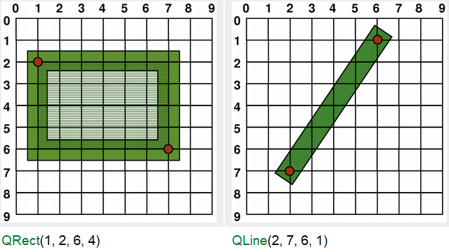
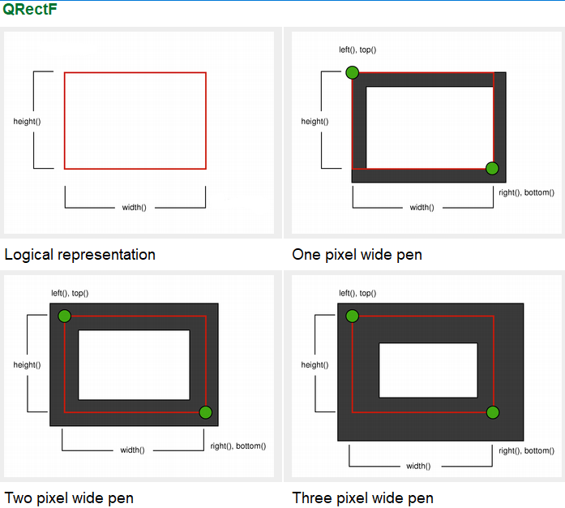
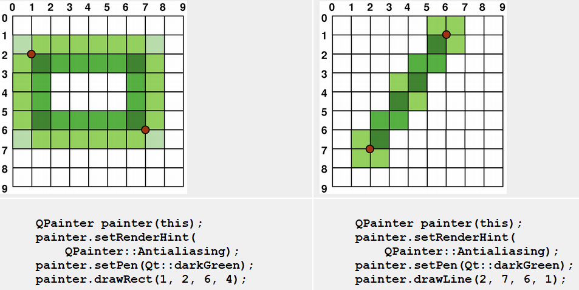

# Coordinate System
### Contents
* [渲染(Rendering)](#index-1)
    * [逻辑表示方法(Logical Representaion)](#index-11)
    * [锯齿化绘制(Aliased Painting)](#index-12)
    * [抗锯齿绘制(Anti-aliased Painting)](#index-13)
* [转换(Transformations)](#index-2)
* [窗体视口变换(Window-Viewport Conversion)](#index-3)

Qt中的坐标系统由QPainter类进行控制。同QPaintDevice、QPaintEngine类一起，QPainter组成了Qt绘制系统的基础。QPainter类用于执行绘制操作，QPaintDevice则是QPainter进行绘制的抽象的二维目标设备。QPaintEngine类提供了QPainter在不同设备上进行绘制时的绘图接口。

QPaintDevice类是所有可以进行绘制的类的基类：QWidget,QImage,QPixmap,QPicture,QOpenGLPaintDevice类都继承了该类。绘图设备的默认坐标系是原点在设备左上角，x轴向右增长，y轴向下增长的坐标系。在基于像素的设备中，一个像素表示一个单位长度，在打印机中，一个点（1/72 inch）表示一个单位长度。

QPainter的逻辑坐标到QPaintDevice的物理坐标的映射，由QPainter的转换矩阵，视口(viewport)和窗口(window)来控制。逻辑坐标和物理坐标默认是一致的。QPainter类支持坐标系的转换（如缩放和旋转）。

## Rendering
### Logical Representaion
一个图元的尺寸总是对应其数学模型，它忽略了渲染该图元的画笔的宽度：  

### Aliased Painting
在进行绘制的时候，像素的绘制由QPainter::Antialiasing渲染提示符控制。

RenderHint枚举类型用于为Qpainter指定是否需要使用绘制引擎提供的一些功能。QPainter::Antialiasing枚举值制定了绘制引擎应当为图元边界进行抗锯齿。例如，通过不同颜色强度使其边界变得平滑。

默认情况下，使用QPainter进行绘制时是保留锯齿的，并且：当进行渲染的画笔的宽度为一个像素的时候，会在数学模型表示的点的右下角进行绘制。例如：  

进行绘制的画笔的宽度为偶数时，像素会按照绘制点对称分布，当画笔宽度为奇数时，不对称的一个像素会绘制到绘制点的左下角。参考QRectF类的说明了解更详细讲解。  

由于历史原因，QRect::right()和QRect::bottom()函数返回的值实际上是偏离了真正的右下角的坐标值一个像素值的。

QRect::right()函数返回left()+width()-1，QRect::bottom()函数实际返回的是top()+height()-1。上图中右下角的绿点是这些函数返回的值。

我们建议为避免这个问题，直接使用QRectF类代替QRect：QRectF类使用更精确的浮点数定义在平面中的点坐标（QRect使用整型）。而且，QRectF::right()和QRectF::bottom()函数返回的点位置是真正的右下角点的坐标值。

如果确实要使用QRect来获取右下角点，那也应该使用x()+width()和y()+height()来代替right()和bottom()函数。

### Anti-aliased Painting
如果QPainter进行绘制时设置了抗锯齿渲染提示符(anti-aliasing render hint)，在数学模型对应点的两侧的像素点会对称渲染。  

## Transformations
默认情况下，QPainter是在与之关联的设备的坐标系上进行操作。但也完全可以通过仿射变换进行坐标系统的转换。

